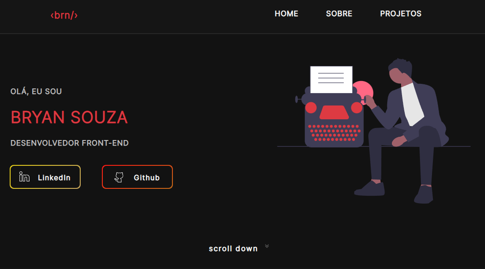

# portifolio Bryan Souza

  

  

<h2>:bookmark_tabs: Descrição</h2>

Meu portfólio. Aplicação criada para mostrar os projetos que irei desenvolver durante minha carreira.

<h2>:dollar: Licença</h2>
<b>Proibida a utilização dos arquivos para fins diferentes de aprendizado.</b>
